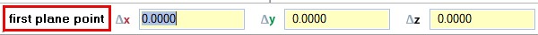
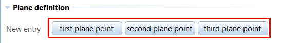
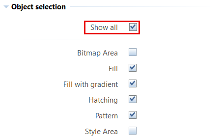
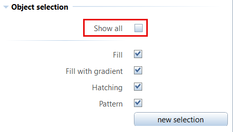
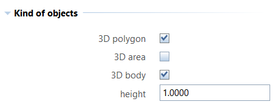

# PythonPart DesignAndModelingTools
The PythonPart contains a set of tools to improve design and modeling workflows within Allplan:
- **Creat3DfromArea** to convert area elements to 3D
- **DrawBodyOnPlane** to create projections of 3D bodies on a plane
- **FlattenCurves** to convert 3D curves to 2D
- **PolygonizeArea** to draw a border around area elements
- **ProjectOnPlan** to create projections of 3D curves on a plane

As each of them is a single PythonPart itself they can be executed and used independend from each other.

## Installation
The PythonPart **DesignAndModelingTools** can be installed directly from the Plugin Manager in ALLPLAN. 

Alternatively, the corresponding ***.allep** package can be downloaded from the [release page](https://github.com/AnkeNiedermaier/design-modeling-tools-public/releases). ***.allep** files are ALLPLAN internal setups that can be installed via drag and drop into the program window.

At least the version 2026 is needed to install the PythonPart.

## Installed PythonPart Scripts
If the installation was successfull, the individual PythonParts **Creat3DfromArea.pyp**, **DrawBodyOnPlane.pyp**, **FlattenCurves.pyp**, **PolygonizeArea.pyp** and **ProjectOnPlan.pyp** can be found
in the ALLPLAN Library:
`Office` → `ALLPLAN GmbH` → `DesignAndModelingTools`\
Besides this, they are also added to the ActionBar in a new created task area **DesignAndModelingTools** in the task Plug-ins.

# Workflow
Although the single PythonParts cover different use-cases, the structure of the corresponding palette is more or less the same. They all contain the sections:
- **Object selection**
- **Format**
- **Creation**

and the **..OnPlane** PythonParts additionally one for the **Plane definition**.\
For the latter the definition of a plane is necessary first, whereas for the others the section **Object selection** is shown directly when the PythonPart is started.

## Plane definition
To specify the plane on which the objects should be projected, the PythonParts **DrawBodyOnPlane** and **ProjectOnPlane** reqiure the input of 3 points as stated in the dialog line.

Each of them can also be modified afterwards in clicking on the corresponding button in the palette.

As soon as the points are set and therefor the plane is determined, the **Object selection** section is also shown in the palette of these PythonParts.

## Object selection
Depending on the functionality, only object types relevant for the individual PythonPart are listed in this section. That means the PythonPart already contains a rough predefined filter for the selection. If the CheckBox **show all** is activated, all possible object types are listed, otherwise only the activated ones.

\

> ⚠️ IMPORTANT\
> In contrast to the listed objects types the PythonPart **ProjectOnPlane** only supports the projection of curves, to project 3D bodies the PythonPart **DrawBodyOnPlane** has to be used!

The selection as such can be executed as usual in Allplan in klicking on a single objects or enter an activation area. As far as they meet the selection filter criteria, all objects inside the area will be taken into account.\
Similar to the plane definition, the object selection can also be modified aftwerwards with the button **new selection** in the palette.

## Formating
Once the selection is finished, also the still missing sections for the execution will be shown. Here the formating (pen, color, layer, ...) can be determined

## Kind of objects (Create3DfromArea)
As this PythonPart offers the possibility to create different kinds of objects from area elements, it contains a sepcial section, where the desired ones and for 3D bodies also a height can be choosen.

## Execution
The final setp to finish the workflow is klicking the **execute!** button in the palette, which creates the relevant objects directly in the active drawing file and if desired also delets their origin.

<a href="https://raw.githubusercontent.com/AnkeNiedermaier/design-modeling-tools-public/main/docs/Design_Modeling_Tools.mp4" target="_blank">
  
</a>
